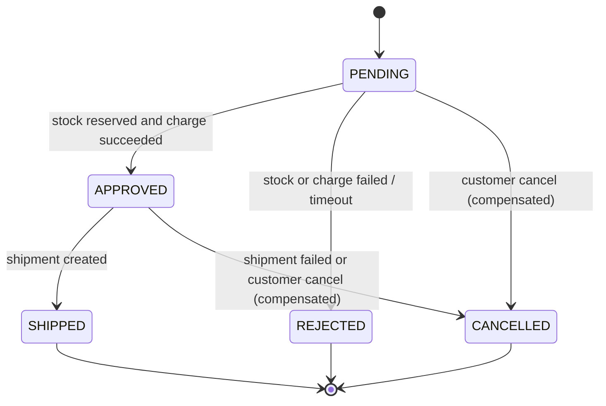

# Project Brief — "OrderFlow": an order-processing platform

## 1. What we are building
OrderFlow is a backend-only platform for placing and fulfilling orders. There is no frontend: the clients are the
VS Code REST Client (`.http` files), curl, pytest, and the demo scripts. The business rules are deliberately simple.
The difficulty is in the **distribution**: separate services and databases, unreliable networks, duplicate and
out-of-order messages, and crashes mid-operation. Those problems are what the patterns solve.

Every pattern must end up as **working, tested, demonstrable code** (see the Definition of Done in `CLAUDE.md`).

## 2. Bounded contexts and services

| Service | Owns (data) | Responsibility | Port | Becomes a service in |
|---|---|---|---|---|
| **gateway** | none | Single entry point: routing, JWT auth, rate limiting | 8000 | Phase 1 |
| **customer** | customers | Customer profile (name, email). Uses a **legacy model** inside the monolith | 8007 | Phase 5 |
| **order** | orders, order_lines, saga state | Accept orders, order state, coordinate fulfilment | 8001 | Phase 5 |
| **inventory** | products, stock, reservations | Catalogue, stock, reserve/release | 8002 | Phase 2 |
| **payment** | wallets, payments | Charge and refund against a simulated wallet | 8003 (REST), 50051 (gRPC) | Phase 2 |
| **shipping** | shipments | Create shipments (simulated courier) | 8004 | Phase 4 |
| **notification** | notification_log | Send "emails" (written to a table and the log) | 8005 | Phase 1 |
| **order-query** | read models | CQRS read side | 8006 | Phase 6 |
| **monolith** | whatever hasn't been extracted yet | Phase 0 app; shrinks until deleted | 8000 in Phase 0, 8010 from Phase 1 | — |

**Legacy customer model (used for the Anti-Corruption Layer):** inside the monolith, customers are stored with
legacy field names `cust_id`, `cust_nm`, `cust_eml`. New services must never use these names. They translate
them in one ACL adapter. The customer service is extracted in Phase 5 with a clean model, and the ACL is then
retired or kept, whichever the ADR decides.

**Payment simplification:** payment performs a single **charge** (authorise and capture combined) and a **refund**.
Real systems usually separate authorise, capture, and void; this can be noted in the ADR as a production difference.

## 3. Core business flow: "Place Order"
1. A client sends `POST /orders` with `customer_id` and `lines[{product_id, quantity}]`.
2. The order is created as `PENDING`, and prices are snapshotted from inventory at creation time.
3. Inventory **reserves** stock for all lines atomically: every line or none.
4. Payment **charges** the order total from the customer's wallet.
5. The order becomes `APPROVED`.
6. Shipping creates a shipment, and the order becomes `SHIPPED`.
7. Notification sends a message on `APPROVED`, `REJECTED`, `SHIPPED`, and `CANCELLED`.

**Failure and compensation rules** (fully enforced from Phase 5):

| Failure point | Compensation | Final state |
|---|---|---|
| Stock reservation fails | none needed | `REJECTED` |
| Charge fails (insufficient funds, payment down) | release the reservation | `REJECTED` |
| Shipment creation fails | refund the charge, release the reservation | `CANCELLED` |
| Customer cancels while `PENDING` | undo any completed steps | `CANCELLED` |
| Customer cancels while `APPROVED` | refund the charge, release the reservation | `CANCELLED` |
| Saga exceeds the timeout (`SAGA_TIMEOUT_S`) | undo any completed steps | `REJECTED` |

**Order state machine:**

(If the diagram doesn't render: PENDING → APPROVED | REJECTED | CANCELLED; APPROVED → SHIPPED | CANCELLED.
SHIPPED, REJECTED, and CANCELLED are terminal.)

## 4. API surface (external, via the gateway)

| Method | Path | Auth (Phase 2+) | Notes |
|---|---|---|---|
| POST | `/auth/token` | none | Dev-only token issuer: `{customer_id, role}` → JWT |
| POST | `/orders` | customer | Requires an `Idempotency-Key` header from Phase 4 |
| GET | `/orders/{id}` | owner or admin | Served by the order service; by the order-query service from Phase 6 |
| POST | `/orders/{id}/cancel` | owner or admin | Allowed in `PENDING` or `APPROVED` |
| GET | `/customers/{id}/orders` | owner or admin | Order history with payment and shipment status. API Composition (Phase 5), then CQRS (Phase 6) |
| GET | `/products`, `/products/{id}` | none | Catalogue |
| POST | `/admin/products/{id}/stock` | admin | Adjust stock |
| POST | `/admin/customers/{id}/wallet` | admin | Top up a wallet (demo) |

Internal service-to-service APIs are designed per phase and recorded in `contracts/`.

## 5. Event envelope (all asynchronous messages)
```json
{
  "event_id": "uuid",
  "event_type": "OrderCreated",
  "event_version": 1,
  "occurred_at": "2026-01-01T10:00:00Z",
  "correlation_id": "uuid",
  "causation_id": "uuid-of-triggering-message-or-null",
  "aggregate_type": "Order",
  "aggregate_id": "uuid",
  "aggregate_version": 3,
  "payload": { }
}
```
`aggregate_version` increases per aggregate. Consumers use it to detect and ignore **stale or out-of-order** events.

**Event catalogue (v1):** `OrderCreated`, `OrderApproved`, `OrderRejected`, `OrderCancelled`, `OrderShipped`,
`InventoryReserved`, `InventoryReservationFailed`, `InventoryReleased`, `PaymentCharged`, `PaymentFailed`,
`PaymentRefunded`, `ShipmentCreated`, `ShipmentFailed`.

Orchestration commands (Phase 5) are separate messages with `command_type` instead of `event_type`, for example
`ReserveInventory`, `ChargePayment`, `CreateShipment`, `ReleaseInventory`, `RefundPayment`.

## 6. Constraints — and the phase each is enforced from
Some constraints are deliberately violated in early phases so the problem can be observed first.

| # | Constraint | Enforced from |
|---|---|---|
| C1 | Stock never goes negative; concurrent orders for the last unit produce exactly one success | Phase 0 |
| C2 | Modules and services interact only through public interfaces or APIs, never through another's tables | Phase 0 (modules), Phase 2 (DB users enforce it) |
| C3 | A service starts and reports `/health/live` even when its dependencies are down; `/health/ready` reports them | Phase 3 |
| C4 | Every outbound call has an explicit timeout | Phase 3 (Phase 2 shows the problem) |
| C5 | Consumers tolerate duplicate and out-of-order messages | Phase 4 |
| C6 | A customer is never charged twice for one order, even under retries and redelivery | Phase 4 |
| C7 | Every order reaches a terminal state; none is stuck in `PENDING` | Phase 5 (Phase 2 shows the problem) |
| C8 | A failed request can be traced end to end in one trace view | Phase 7 |
| C9 | Everything runs offline on one laptop; heavy parts are opt-in Compose profiles | Always |

## 7. Failure-injection knobs (from Phase 3; used in every later phase)
Per-service environment variables:

| Variable | Effect |
|---|---|
| `FAIL_RATE` | 0.0–1.0 probability that a request or handler returns an error |
| `LATENCY_MS`, `LATENCY_JITTER_MS` | Artificial delay |
| `CRASH_AFTER_DB_COMMIT` | Exit the process right after a commit (outbox demo) |
| `CRASH_AT_SAGA_STEP` | Exit when the saga reaches step N (saga recovery demo) |

Pattern toggles are also env vars (`OUTBOX_ENABLED`, `IDEMPOTENCY_ENABLED`, `BREAKER_ENABLED`, …), so each
demo can show before and after without switching branches.

## 8. Seed data
- 10 products, with at least one having stock = 1 (used for the concurrency test).
- 5 customers with wallet balances, including one with a zero balance (used for the payment failure path).

## 9. Out of scope
Real payment providers, a UI, multi-region deployment, production security hardening, and cloud deployment.
Cloud deployment can be a follow-up project after Phase 9.
