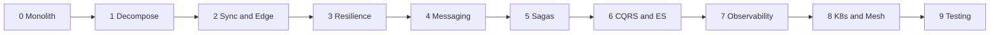

# Roadmap — Phases 0 to 9

**The loop for every phase:**
Understand → Break it (failing test or toggle) → Fix it with the pattern → Prove it (tests and demo) → Record the ADR → Tag it

(Text version: 0 Monolith → 1 Decompose → 2 Sync and Edge → 3 Resilience → 4 Messaging → 5 Sagas →
6 CQRS and Event Sourcing → 7 Observability → 8 Kubernetes and Mesh → 9 Testing and Hardening)

**Rules for every phase**
- The "Definition of Done" in `CLAUDE.md` applies: code runs, tests pass (including failure paths), and Claude has
  actually run them.
- Every phase ships `scripts/demo/phase-N.sh`, which shows the problem (toggle off) and the fix (toggle on) against
  the running stack.
- Tests are written in every phase. Phase 9 adds contract tests and a chaos day on top; it does not start testing.
- Effort: roughly 1–2 weeks per phase part-time. This is a guess and varies widely; don't treat it as a target.

---

## Phase 0 — Modular monolith (baseline)
**Goal:** A working "Place Order" flow in one process and one database, with clean module boundaries.
**Patterns:** Monolithic Architecture, Modular Monolith, Aggregate.

**Tasks**
1. Set up the uv workspace, `Makefile`, ruff, mypy, pytest config, `.env.example`, and a test fixture that starts
   Postgres via testcontainers.
2. Create `monolith/` (FastAPI) with modules `customer`, `order`, `inventory`, `payment`, `shipping`, and
   `notification`. Each module has `api/`, `domain/`, and `infra/` layers. The customer module uses the legacy
   field names from the brief.
3. Use one Postgres database with **one schema per module**.
4. Modules call each other only through a public Python interface (e.g. `inventory.service.reserve(...)`), never by
   importing another module's tables or ORM models. Add an automated import-boundary check, for example a pytest
   test that scans imports; `import-linter` is an option if you verify its current config format.
5. Implement the full flow inside **one database transaction**. The shipping and notification steps are
   synchronous function calls.
6. Add Docker Compose (`postgres`, `monolith`), Alembic migrations, seed data, and `.http` files for every endpoint.

**Break it:** Add a concurrency test in which 10 parallel orders compete for the product with stock = 1.
First implement the naive version (read stock, check it in Python, then write) and show that more than one order
succeeds. Fix it with an atomic conditional update (`UPDATE … SET qty = qty - :n WHERE id = :id AND qty >= :n`)
or `SELECT … FOR UPDATE`.

**Demo (`phase-0.sh`):** Places a successful order, then an insufficient-funds order, then fires 10 parallel orders
for the last unit. It prints the final states and remaining stock.

**Acceptance criteria**
- [ ] `make clean && make up && make demo-0` works on a fresh clone.
- [ ] The concurrency test proves exactly one winner.
- [ ] A payment failure leaves stock unchanged (single-transaction rollback), verified by a test.
- [ ] The import-boundary test fails if one module imports another module's internals.
- [ ] ADR-0001 records the modular monolith and its module boundaries.

**Self-check:** List every guarantee you got for free from one ACID transaction. Each later phase removes one.

---

## Phase 1 — Decomposition
**Goal:** Extract the first service without changing the client-facing API.
**Patterns:** Decompose by Business Capability, Decompose by Subdomain, Strangler Fig, Anti-Corruption Layer.

**Tasks**
1. Write `docs/context-map.md`: the bounded contexts, their upstream and downstream relationships, and why.
2. Build `gateway/`, a hand-written FastAPI + httpx reverse proxy on port 8000. Move the monolith to port 8010.
   All client traffic now goes through the gateway.
3. Extract **notification** as a service with its own database. The monolith calls it over HTTP instead of a
   function call.
4. A toggle `NOTIFICATION_ROUTE=monolith|service` switches which implementation is used. This is the Strangler Fig
   mechanism.
5. **ACL:** notification needs the customer's name and email. It calls the monolith's legacy customer endpoint
   (`cust_nm`, `cust_eml`) through a single adapter module that maps to a clean `Recipient(name, email)` model.

**Break it:** Stop the notification container and place an order. Record exactly what happens to the order.
It will likely fail or hang; Phase 3 fixes this.

**Demo (`phase-1.sh`):** Runs the same requests with both route toggles, showing identical client responses.
Then it stops notification and shows the failure.

**Acceptance criteria**
- [ ] All Phase 0 `.http` requests and tests still pass through the gateway.
- [ ] Legacy field names appear only in the ACL module; this is checked by a test or grep in `make lint`.
- [ ] ADR-0002 records the decomposition approach and why notification was extracted first.

**Self-check:** Where do business-capability and subdomain decomposition agree here, and where might they differ?

---

## Phase 2 — Synchronous communication and the edge
**Goal:** Extract inventory and payment with their own databases, and build a real edge layer.
**Patterns:** Remote Procedure Invocation (REST and gRPC), Database per Service, API Gateway, Backends for Frontends,
Service Registry, Client-side vs Server-side Discovery, Self-registration, Access Token (JWT).

**Tasks**
1. Extract **inventory** (REST) and **payment** (gRPC; the `.proto` lives in `contracts/proto/`, and a
   `make proto` target generates the code reproducibly). Each gets its own database and DB user with no grants
   on other databases. Remove those tables from the monolith with a migration.
2. The monolith's order module now calls inventory and payment over the network. **Deliberately no timeouts and
   no compensation.**
3. Gateway: JWT validation (HS256 dev key from env) and a `/auth/token` dev issuer. Role checks for `/admin/*`.
   Pass through `X-Correlation-ID`.
4. **BFF:** add `/mobile/orders/{id}`, which returns a trimmed summary, next to the full response.
5. **Discovery**, in three steps with trade-offs recorded:
   (a) static URLs from env; (b) server-side discovery via Compose DNS names;
   (c) client-side discovery with self-registration against Consul, under an opt-in `discovery` profile.
6. On a branch, replace the hand-written gateway with Traefik or Kong. Compare, and decide in the ADR which stays.

**Break it** (both kept as `xfail` tests with clear reasons):
- Make payment fail *after* inventory reserved stock. Stock leaks permanently. (Fixed in Phase 5.)
- Make payment take 30 s. The client waits 30 s or more. (Fixed in Phase 3.)

**Demo (`phase-2.sh`):** Shows a request rejected without a token, an order placed with a token, the mobile vs full
responses, and a DB-permission error when one service tries to read another's database.

**Acceptance criteria**
- [ ] A test proves that service A's DB user cannot read service B's database.
- [ ] REST and gRPC paths both have component tests; `make proto` regenerates cleanly.
- [ ] Requests without a valid JWT, or `/admin/*` without the admin role, get 401/403 at the gateway.
- [ ] The two xfail tests exist and fail for the documented reason.
- [ ] ADR-0003 (REST vs gRPC), ADR-0004 (gateway), ADR-0005 (discovery).

**Self-check:** Which Phase 0 guarantees did Database per Service remove?

---

## Phase 3 — Resilience
**Goal:** Failures become bounded, fast, and isolated.
**Patterns:** Timeout, Retry (exponential backoff and jitter), Circuit Breaker, Bulkhead, Rate Limiter, Fallback,
Health Check API.

**Tasks**
1. Add the failure-injection knobs from the brief to inventory, payment, and notification.
2. Add explicit timeouts on every httpx and gRPC call (constraint C4).
3. **Retry:** hand-write a retry decorator in `libs/common/resilience/` with unit tests. Then swap in `tenacity`
   behind the same interface. Retry only operations proven safe; list them in the ADR. Note that payment's charge
   is **not yet** safe to retry, because idempotency arrives in Phase 4.
4. **Circuit breaker:** hand-write an async three-state breaker (CLOSED → OPEN → HALF_OPEN) tested with an
   injectable clock. Optionally compare it with `pybreaker`, after checking its async support in the installed version.
5. **Bulkhead:** separate httpx connection pools and `asyncio.Semaphore` limits per downstream.
6. **Rate limiter:** a Redis token bucket at the gateway that returns 429 with `Retry-After`. The Lua script, or
   whichever atomic approach you choose, must be tested.
7. **Fallback:** if notification is unavailable, the order still succeeds. The notification is stored in a local
   `pending_notifications` table and retried by a background task.
8. Add `/health/live` and `/health/ready` to every service, and wire them into Compose `healthcheck`s.

**Break it:** With `BREAKER_ENABLED=false`, set payment to `FAIL_RATE=0.5` and `LATENCY_MS=5000`, and run a load
script (asyncio + httpx or `locust`). `GET /products` latency collapses because of shared resources. Then enable
the breaker and bulkhead and compare. Also show a retry storm with retries set high and no jitter.

**Demo (`phase-3.sh`):** Prints p50/p95 latency and error counts before and after for the same load, plus breaker
state transitions from the logs.

**Acceptance criteria**
- [ ] The Phase 2 "30 s wait" xfail now passes: the client gets a failure within the configured timeout.
- [ ] Breaker unit tests cover all transitions with a fake clock.
- [ ] The load script proves the bulkhead: `GET /products` p95 stays within 2× its baseline while payment is degraded.
- [ ] Burst traffic gets 429s with `Retry-After`.
- [ ] An order succeeds while notification is down, and the notification is delivered after it recovers.
- [ ] ADR-0006 records per-downstream policy (timeouts, retries, breaker thresholds) and the reasoning.

**Self-check:** When does a retry make an outage worse? Why must non-idempotent operations not be retried blindly?

---

## Phase 4 — Asynchronous messaging
**Goal:** Decouple with events and make publishing and consuming reliable.
**Patterns:** Messaging (pub/sub and point-to-point), Domain Event, Transactional Outbox, Polling Publisher,
Transaction Log Tailing, Idempotent Consumer, Dead-Letter Queue, Idempotency Key (API).

**Tasks**
1. Add RabbitMQ with its management UI (Compose `messaging` profile, enabled by default from now on). Use a topic
   exchange `orderflow.events` and one durable queue per consumer, with a dead-letter exchange.
2. Add the event envelope and schemas in `libs/common/events` and `contracts/events/`.
3. Extract **shipping** as a service that is driven only by events.
4. Switch notification from HTTP calls to consuming events. Remove the Phase 3 fallback table, or keep it and
   explain why in the ADR.
5. **Naive publishing first:** commit to the DB, then publish (toggle `OUTBOX_ENABLED=false`).
6. **Outbox:** the business row and the outbox row are written in the same transaction, and a polling publisher
   relays them (`libs/common/outbox/`). Relay rows in order and mark them sent.
7. **Idempotent consumer:** a `processed_messages(event_id)` insert in the same transaction as the handler's side
   effects (toggle `IDEMPOTENCY_ENABLED`). Stale events are ignored using `aggregate_version`.
8. **API idempotency:** `POST /orders` requires an `Idempotency-Key` header. The same key returns the stored
   original response; the same key with a different body returns 422.
9. **Payment charge idempotency:** the charge is keyed by `order_id`, so a retried charge never double-charges
   (constraint C6). Charge is now safe to retry, so enable its retry policy.
10. Add a DLQ with a max-delivery limit, plus `scripts/dlq.py` to list and replay messages.
11. **Stretch:** transaction log tailing with Debezium (Postgres logical replication), under the `debezium` profile.

**Break it:**
- With the outbox off and `CRASH_AFTER_DB_COMMIT=true`, the order is saved but the event is lost forever.
- With idempotency off, redeliver the same `OrderApproved` event and get two shipments.

**Demo (`phase-4.sh`):** Runs both break-it scenarios with the toggles off, then on, and prints DB counts to prove
lost-vs-delivered and duplicate-vs-single. It then sends a poison message and shows it land in the DLQ.

**Acceptance criteria**
- [ ] With the outbox on, the crash test passes: the event is published after restart.
- [ ] With idempotency on, the duplicate-delivery test gives exactly one shipment.
- [ ] Duplicate `Idempotency-Key` gives one order; a mismatched body gives 422.
- [ ] Retrying a charge never double-charges (test).
- [ ] A poison message reaches the DLQ after N attempts, and it can be replayed.
- [ ] ADR-0007 (broker topology), ADR-0008 (outbox relay: polling vs log tailing).

**Self-check:** Why is exactly-once *delivery* generally impossible, and what makes processing *effectively once*?

---

## Phase 5 — Distributed data and Sagas
**Goal:** Consistency across services without distributed transactions, and complete the Strangler Fig.
**Patterns:** Saga (choreography and orchestration), Compensating Transaction, Semantic Lock, API Composition,
Shared Database (anti-pattern demo).

**Tasks**
1. Extract **order** and **customer** from the monolith. Customer gets the clean model; decide in the ADR whether
   the ACL is retired or kept. **Delete `monolith/`.** The Strangler Fig is complete.
2. **Choreography saga:** services react to each other's events. Draw the event flow in the ADR.
3. **Orchestration saga:** a `CreateOrderSaga` state machine in the order service sends commands and handles
   replies. Saga state is persisted, so the saga resumes after a crash. Toggle with `SAGA_MODE=choreography|orchestration`.
4. Implement every compensation in the brief's failure table, including customer cancel mid-saga.
   The Phase 2 "stock leak" xfail must now pass.
5. **Semantic lock:** `PENDING` blocks conflicting operations. Define and test what happens to a cancel request
   that arrives mid-saga.
6. Add a timeout sweeper: sagas older than `SAGA_TIMEOUT_S` are compensated to `REJECTED` (constraint C7).
7. **API Composition:** `GET /customers/{id}/orders` composes data from order, payment, and shipping. On partial
   failure it returns partial data with a `degraded: true` flag.
8. **Stretch:** re-implement the orchestrator with Temporal (`temporalio`) on a branch. The Temporal dev server can
   be started from the Temporal CLI; check the current command in its docs. Compare code size, visibility, and
   failure handling.
9. **Anti-pattern demo (branch only):** two services share a table, and a column rename in one breaks the other.

**Break it:** `CRASH_AT_SAGA_STEP=N` for each step. On restart, the saga must resume or compensate correctly.

**Demo (`phase-5.sh`):** Runs every row of the failure table in both saga modes and prints the final order state,
stock, and wallet balances.

**Acceptance criteria**
- [ ] A parametrised test over the failure table × both saga modes passes, and balances and stock reconcile.
- [ ] The crash-at-every-step test passes, and no order is left in `PENDING`.
- [ ] The composed endpoint returns degraded data when payment is down.
- [ ] `monolith/` no longer exists; the client API is unchanged.
- [ ] ADR-0009 compares choreography vs orchestration (and Temporal, if done).

**Self-check:** Sagas lack isolation (the "I" in ACID). Which anomalies can occur here, and which countermeasures did you use?

---

## Phase 6 — CQRS and Event Sourcing
**Goal:** Separate reads from writes, and use events as the source of truth for Order.
**Patterns:** CQRS, Event Sourcing, Snapshot, Event Upcasting, Read-model rebuild.

**Tasks**
1. Event-source the **Order** aggregate in an append-only `order_events` table with a unique
   `(aggregate_id, version)`, giving optimistic concurrency. State is rebuilt by folding events. The outbox now
   relays from the event table itself; document how.
2. Take a snapshot every N events, and measure rebuild time with and without snapshots.
3. Build the **order-query** service: consume events into denormalised read models (Postgres, plus a Redis cache).
   `GET /orders/{id}` and `GET /customers/{id}/orders` move here, replacing API Composition. Keep composition
   behind a toggle for comparison.
4. Rebuild from scratch: drop the read model and replay all events (`make rebuild-read-models`).
5. Versioning: introduce `OrderCreated` v2 with a new field, plus an upcaster so v1 events still load.
6. **Optional (`kafka` profile):** use Kafka as the event log for the query side, and compare retention, replay,
   and per-partition ordering with RabbitMQ.

**Break it:** Read immediately after a write and observe stale data. Implement and document one mitigation, for
example returning `aggregate_version` on writes and letting clients poll until the read model reaches it.

**Demo (`phase-6.sh`):** Places orders, shows the event stream, drops and rebuilds the read model, and diffs the
before and after.

**Acceptance criteria**
- [ ] A test proves the current state equals the fold of its events (optionally with property-based tests via `hypothesis`).
- [ ] A rebuilt read model is identical to the live one.
- [ ] Mixed v1 and v2 events load correctly.
- [ ] A concurrent-write test proves the optimistic concurrency conflict is detected.
- [ ] ADR-0010 records why only Order is event-sourced, and the costs you observed.

**Self-check:** When is event sourcing *not* worth it?

---

## Phase 7 — Observability
**Goal:** See any request's journey and any service's health.
**Patterns:** Log Aggregation, Distributed Tracing, Application Metrics, Exception Tracking, Audit Logging, Correlation ID.

**Tasks**
1. Structured JSON logs (structlog, via `libs/common/logging`), always including `service`, `correlation_id`, and `trace_id`.
2. OpenTelemetry: instrument FastAPI, httpx, SQLAlchemy, and gRPC. For RabbitMQ, an
   `opentelemetry-instrumentation-aio-pika` package exists on PyPI. Check its compatibility with your versions;
   otherwise propagate trace context manually through message headers.
3. Add an `observability` Compose profile: OTel Collector → Jaeger (traces), Prometheus (metrics), Loki (logs),
   and Grafana with a provisioned dashboard showing RED metrics per service.
4. Exception tracking: group unhandled exceptions by type and location, using a self-hosted tool or log-based grouping.
5. Audit log: an append-only record of actor, action, order, and timestamp.

**Break it:** Inject a payment fault, then diagnose it using only Grafana, Jaeger, and Loki, without reading code.
Write down the steps.

**Demo (`phase-7.sh`):** Places an order that fails in payment and prints the Jaeger trace URL and the Loki query
for its correlation ID.

**Acceptance criteria**
- [ ] One trace spans gateway → order → inventory → payment → RabbitMQ → shipping → notification.
- [ ] The dashboard shows rate, errors, and duration per service.
- [ ] One Loki query by correlation ID returns logs from every service involved.
- [ ] ADR-0011 records the stack and sampling choices.

---

## Phase 8 — Deployment, configuration and service mesh
**Goal:** Run on Kubernetes, and move cross-cutting concerns into the platform where it makes sense.
**Patterns:** Service per Container, Externalized Configuration, Sidecar, Service Mesh, Blue-Green, Canary,
Microservice Chassis, Service Template.

**Tasks**
1. Harden images: multi-stage builds, non-root user, minimal base image, `.dockerignore`.
2. **Chassis and template:** consolidate `libs/common`, and create a copier or cookiecutter template that generates
   a new service with health checks, logging, tracing, outbox, and tests already wired in.
3. Deploy to **kind**: Deployments, Services, ConfigMaps, Secrets, liveness and readiness probes on `/health/*`,
   and resource requests and limits. `make k8s-up` does everything. Run a subset of services if RAM is tight.
4. **Sidecar:** add a log-shipping or proxy sidecar to one service, and document what moved out of the app.
5. **Mesh:** install Linkerd (lighter) or Istio. Move mTLS, retries, and timeouts into mesh configuration, and
   compare with the Phase 3 in-code approach.
6. Blue-green for payment (switch the Service selector) and canary for inventory (weighted routing via the mesh).

**Break it:** Deploy a deliberately broken payment v2 as a 10% canary, detect it from error metrics, and roll back.

**Demo (`phase-8.sh`):** Runs the canary rollout, shows the error-rate difference, and runs the rollback command.

**Acceptance criteria**
- [ ] `make k8s-up` brings the platform up on kind from scratch.
- [ ] A service generated from the template passes its tests and health checks with no hand edits.
- [ ] The canary rollback is demonstrated using metrics.
- [ ] ADR-0012 covers which resilience features belong in code and which in the mesh.

---

## Phase 9 — Testing and hardening
**Goal:** Enough confidence to change and deploy any service independently.
**Patterns:** Consumer-Driven Contract Test (HTTP and messages), Service Component Test, Test Pyramid.

**Tasks**
1. Consumer-driven contracts with `pact-python`: gateway → order, order → inventory (HTTP), and message pacts for
   `OrderCreated` and `PaymentCharged`. pact-python's API has changed across major versions, so follow the docs for
   the version you install. Use a Pact Broker via Docker or file-based pacts.
2. Fill gaps in component tests, so every service has them (real Postgres and RabbitMQ via testcontainers; other
   services stubbed).
3. Keep a small end-to-end suite in `tests/e2e/`: the happy path plus the top three failure sagas.
4. CI with GitHub Actions (requires the repo on GitHub): lint → unit → contract → component, per service,
   triggered on changed paths.
5. **Chaos day:** randomly kill containers during a load test, then verify constraints C1–C7 still hold by
   reconciling stock, wallets, and order states.

**Demo (`phase-9.sh`):** Breaks an inventory response field and shows the consumer contract test fail. Then runs
the chaos script and prints the reconciliation report.

**Acceptance criteria**
- [ ] An incompatible provider change fails the contract tests locally and in CI.
- [ ] The test pyramid is documented, with counts per level and total run time.
- [ ] `docs/chaos-day.md` shows a clean reconciliation, or the bugs found and fixed.
- [ ] ADR-0013 records the testing strategy.

---

## Phase 10 — Adding new services to a mature architecture (planned; build after Phase 9)
**Status:** agreed 2026-09-29 as future work. Nothing here is designed or decided yet. Plan it at the start of
the phase (in `docs/phases/phase-10.md`), as for every other phase.

**Goal:** add two new services the way a mature microservices team would. The system is already running with
separate services, databases, messaging and monitoring, and the new services must not break any of it.
**Patterns (expected):** Bounded Context design for a new service, Database per Service, event-carried data,
CQRS read models, data backfill, feature flags, consumer-driven contracts.

**The two services and the problem each one brings:**

| Service | Kind of cross-module dependency it creates | Why it's hard |
|---|---|---|
| **Reporting / Stats** | **B: a query across modules.** It needs data owned by order, payment, shipping and customer at once (e.g. "revenue per day", "orders per customer with shipment status") | By then every service has its own database, so a single SQL `JOIN` across them is impossible |
| **Loyalty program** | **C: a shared table.** Points are earned per order, so the obvious (wrong) design is to add a `points` column to the order's table and let two services write it | Two writers on one table means neither service can change, deploy or move its data on its own |

**Questions to answer when the phase starts** (not decided now):
1. **Where does each service get its data?** Options include calling the owners' APIs, keeping its own copy
   updated from events (Phase 4), or a read model built from events (Phase 6).
2. **How is it introduced safely?** Options include contract-first API and event schemas, a backfill of
   historical data, running it in "shadow" mode, and turning it on with a feature flag.
3. **Who owns what data?** For loyalty: which service owns "points", and how does it learn that an order was
   paid, cancelled or refunded?
4. **How do we prove it didn't break anything?** Options include contract tests, end-to-end tests and the
   chaos checks from Phase 9.
5. **Break it first:** build the naive version (a cross-database `JOIN` for reporting, a shared `points` column
   for loyalty), watch it fail, then fix it the professional way.

**Acceptance criteria:** written when the phase is planned.

---

## After Phase 9 (optional)
- Deploy to a managed Kubernetes service in the cloud.
- Add a GraphQL aggregation layer.
- Add multi-tenancy.
- Replace RabbitMQ with Kafka entirely.
- Add Outbox + CDC for every service.
