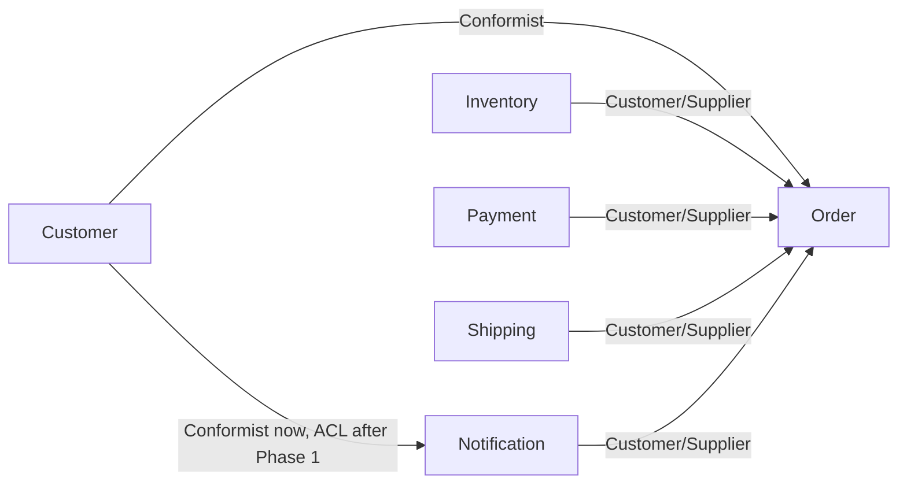

# OrderFlow context map

<!-- Phase 1, step 1. Written by Claude at the learner's request ("you write it"); questions A1–A6 are in
     docs/phases/phase-1.md → section 6 → Step 1. Facts checked against the code on 2026-09-29. -->

This map shows the six parts of OrderFlow, what each one owns, and which parts depend on which. It describes
the system as it is at the end of Phase 0: all six parts are still modules inside one program with one
database (one schema each).

**Words used on this page:**

| Term | Plain meaning |
|---|---|
| **Bounded context** | One part of the system, with its own data and its own vocabulary. Here: one module now, one service later |
| **Upstream / downstream** | If A uses B's functions, B is **upstream** and A is **downstream**. A has to follow B's function names and data; a change in B can break A, but not the other way round |
| **Conformist** | The downstream part simply uses the upstream part's data as it is, names and all |
| **Customer/Supplier** | The downstream part asks for what it needs, and the upstream part shapes its functions to serve it |
| **Anti-Corruption Layer (ACL)** | One small translator at the border that turns the upstream part's awkward data into clean names, so the awkward names never spread into the downstream part |
| **Core / supporting / generic** | Core: why the business exists. Supporting: needed and specific to us, but not what we compete on. Generic: the same for every business, so you could buy it |

## 1. Bounded contexts

| Context | Capability (3–5 words) | Subdomain type + why (one line) | Owns data (tables) | Today (module) | Service from phase |
|---|---|---|---|---|---|
| **Order** | Accept and track orders | **Core**: coordinating an order from request to shipment is what OrderFlow exists to do | `orders.orders`, `orders.order_lines` | `modules/order` | 5 |
| **Inventory** | Keep and reserve stock | **Supporting**: must be correct (never oversell, C1) and is specific to us, but it isn't what we compete on | `inventory.products` | `modules/inventory` | 2 |
| **Payment** | Charge and refund customers | **Generic**: in real life you'd buy this (a payment provider); here it's a simulated wallet | `payment.wallets`, `payment.payments` | `modules/payment` | 2 |
| **Shipping** | Hand goods to a courier | **Generic**: a courier integration; you'd use a carrier's API rather than build one | `shipping.shipments` | `modules/shipping` | 4 |
| **Notification** | Tell customers what happened | **Generic**: sending email is a commodity (an email SaaS) | `notification.notification_log` | `modules/notification` | **1** |
| **Customer** | Keep customer profiles | **Supporting**: needed everywhere, not a differentiator, and stuck with a **legacy model** (`cust_id`, `cust_nm`, `cust_eml`) | `customer.customers` | `modules/customer` | 5 |

No table belongs to two contexts (A5). There are also no foreign keys across schemas: contexts refer to each
other by ID only (e.g. `payment.payments.order_id` is just a UUID, not a foreign key to `orders.orders`).

## 2. Relationships

One row per module pair. Derived from
`grep -rn --include=*.py "import service as" monolith/src/monolith/modules` (7 import lines → 6 pairs).

| Upstream | Downstream | What flows (call and data) | Relationship type | Why this type |
|---|---|---|---|---|
| Customer | Order | `customer.get_customer(id)`: does this customer exist? Returns the legacy `Customer` | **Conformist** | Order only checks existence, so it never touches the legacy field names; adopting customer's model as-is costs nothing |
| Customer | Notification | `customer.get_customer(id)` → reads `cust_nm`, `cust_eml` to address the email | **Conformist today → ACL after Phase 1** | Today notification uses the legacy names directly. Once it's a service, a single adapter translates them into a clean `Recipient(name, email)`, so the legacy model can't leak in |
| Inventory | Order | `get_products` (prices for the snapshot), `reserve` (take stock, all or nothing), and `ProductNotFoundError` / `InsufficientStockError`. Two import lines: `order/service.py` for the flow, `order/api/routes.py` only to map `ProductNotFoundError` to 422 | **Customer/Supplier** | Order's needs shape inventory's interface (e.g. the atomic `reserve`), and inventory stays the only owner of stock |
| Payment | Order | `charge(order_id, customer_id, amount, currency)`, and `InsufficientFundsError` | **Customer/Supplier** | Same shape as inventory; payment alone owns money. In reality payment would be an external provider, and order would then be Conformist to *its* API |
| Shipping | Order | `create_shipment(order_id)` | **Customer/Supplier** | Order asks, shipping decides how. Simulated; a real carrier API would make order Conformist |
| Notification | Order | `notify_order_status(order_id, customer_id, status, reason)` | **Customer/Supplier** (today) | Order calls notification's function, so notification's signature is upstream. **This flips in Phase 4:** order will publish events and notification will consume them, making order upstream |

**Fan-in / fan-out** (the step 1 prediction):

| Context | Depended on by (distinct modules) | Depends on |
|---|---|---|
| Customer | 2 (order, notification) — **most** | nothing |
| Inventory | 1 (order) | nothing |
| Payment | 1 (order) | nothing |
| Shipping | 1 (order) | nothing |
| Notification | 1 (order) | customer |
| Order | 0 — **fewest** | 5 (all the others) — the orchestrator |

## 3. Diagram

Arrows go from **upstream to downstream**.


(Text version: customer → order (Conformist); customer → notification (Conformist now, ACL after Phase 1);
inventory, payment, shipping and notification → order (Customer/Supplier).)

## 4. How to split the system: our final call

### The two ways of drawing the lines
There are two common ways to decide where one service ends and the next begins:

- **By business capability:** one part for each thing the business *does*. "Take orders", "keep stock",
  "take payments", "ship parcels", "email customers", "keep customer details".
- **By subdomain:** one part for each area of the *problem*, grouping things that belong together
  closely. For example, "checkout" might mean everything that happens while a customer is buying.

Most of the time both methods draw the same lines. The interesting part is where they don't.

### Where both methods agree
**Payment, shipping and notification are each their own part** under both methods. Each does one clear job,
and each is something any shop needs in the same way, the kind of thing you could buy from a vendor.
Those are also the safest parts to split off first, because nothing in them is unique to us.

### Where they could disagree
**1. Should order and stock reservation be one part ("checkout")?**
- *For:* setting stock aside only happens because of an order, so they belong together.
- *Against:* stock also changes for reasons that have nothing to do with orders: an admin corrects a
  count, a customer returns an item, a supplier delivers more.

**2. Should shipping and notification be one part ("after the sale")?**
- *For:* both happen after the order is decided.
- *Against:* they change for different reasons (a new courier contract vs a new message channel such as SMS)
  and would come from different vendors.

### Our final call: split by business capability, into six parts
**Order, inventory, payment, shipping, notification and customer each become their own part, and later their
own service.** Why:

1. **The data is already separate.** Each module has its own tables, and no table has two owners (A5). A part
   that owns its data can move out without dragging other parts' data with it.
2. **Each part changes for its own reasons.** A new courier shouldn't force a redeploy of payment; a change to
   email wording shouldn't touch stock.
3. **It matches the project plan.** The brief already lists these six as separate services, and each later phase
   introduces its patterns by extracting one of them.

### What this choice costs us, in plain words
Splitting is not free. Once parts are separate services, they talk over the network instead of inside one
program, and they no longer share one database. The most visible cost shows up between **order and stock**:

- **Today (one database):** placing an order sets the stock aside and takes the payment in **one
  all-or-nothing database step**. If the payment fails, the database automatically puts the stock back, as
  if nothing happened. We saw this in the Phase 0 demo: Zoe's order failed and the keyboard stock didn't change.
- **Phase 2 (inventory and payment get their own databases):** setting stock aside is saved in the inventory
  database, then the payment is attempted in the payment database. If the payment fails, nothing
  automatically puts the stock back. The keyboard stays "reserved" for an order that will never happen, and
  it can't be sold to anyone else. We call this a **stock leak**, and Phase 2 shows it on purpose.
- **Phase 5 (the fix):** the order service runs the steps one by one and, for each step, knows how to undo it.
  "Payment failed → tell inventory to release the stock." This way of running a multi-step process with an
  undo action for each step is called a **saga**.

Keeping order and stock together ("checkout") would avoid that problem, but it would bundle two things that
change for different reasons. We accept the cost, because learning to handle it is one of the main goals
of this project.

## 5. Open questions

- **A round trip between two services:** once notification is a service, placing an order goes monolith →
  notification service → back to the monolith (to look up the customer's name and email). It works, but the
  two services now depend on each other in both directions. Two ways out: the monolith sends the name and email
  along with the request, or we keep the lookup until customer becomes its own service in Phase 5.
  To be decided in ADR-0002.
- **Who runs the order process once inventory and payment move out (Phase 2)?** Order still does, but it loses
  the all-or-nothing database step, so a failure halfway through needs explicit undo actions (Phase 5, "sagas";
  see section 4).
- **Who calls whom changes in Phase 4:** today order *calls* notification. From Phase 4, order will just announce
  "this order was shipped" as a message, and notification will listen for it. Order then no longer depends on
  notification at all. Worth redrawing this map then.
- **Customer:** do we keep building it ourselves in Phase 5, or treat it as something to buy (an identity or
  CRM product)?

---

## 6. Guiding questions A1–A6, answered in full

The questions come from the Phase 1 step 1 card. Each answer below stands on its own; the sections above
summarise the same facts.

### A1. What does the business do in each module, in 3–5 words?

Ignoring the code and thinking about a real shop:

| Context | Capability | What that means day to day |
|---|---|---|
| Order | **Accept and track orders** | Take a customer's request, fix its prices, decide whether it can go ahead, and record its status (PENDING → APPROVED → SHIPPED, or REJECTED / CANCELLED) |
| Inventory | **Keep and reserve stock** | Know how many of each product exist, set them aside for an order, and never sell more than exist |
| Payment | **Charge and refund customers** | Take money from the customer's wallet for an order, and give it back if needed |
| Shipping | **Hand goods to a courier** | Book the delivery of an approved order |
| Notification | **Tell customers what happened** | Send an "email" when an order is approved, rejected, shipped or cancelled |
| Customer | **Keep customer profiles** | Store who the customer is: name and email address |

### A2. Which context is core, and which could be bought?

Test used: *"Is this why the business exists?"* (core) · *"Is it specific to us but not what we compete on?"*
(supporting) · *"Would we happily pay a vendor for it?"* (generic).

Two different questions are answered here:
- **"Would a real business buy it?"** is a thinking tool for *classifying* each part. It isn't a purchase.
- **"What do we build in OrderFlow?"** is the practical decision. OrderFlow is a free learning project, so
  **everything is built by us, kept simple, and costs nothing**. Parts a real business would buy are dummies
  here: they behave like the real thing from the outside, but nothing real happens.

| Context | Type | Reasoning | Would a real business buy it? | What we build in OrderFlow |
|---|---|---|---|---|
| Order | **Core** | Coordinating an order from request to shipment *is* OrderFlow; this is where our rules live | No; this is ours | Our own module, with the real business rules |
| Inventory | **Supporting** | Must be exactly right (constraint C1: never oversell) and is tied to our catalogue, but no customer picks us for our stock-keeping | Possibly, as part of a warehouse system | **Our own simple table** of products and stock. Enough, as long as it never sells more than exists (a database check plus the atomic stock update from Phase 0) |
| Customer | **Supporting** | Needed everywhere, not a differentiator; it also carries a legacy model we can't change yet | Possibly (a CRM or identity product) | **Our own simple table**, deliberately with old-style names (`cust_nm`, `cust_eml`) so we can practise the translator (ACL) |
| Payment | **Generic** | Every shop charges money in the same way | **Yes**: a payment provider | **Dummy**: a simulated wallet balance per customer; no real money. Later phases add fake failures to test resilience |
| Shipping | **Generic** | Booking a courier is the same for everyone | **Yes**: a carrier's API | **Dummy**: records a shipment; nothing is physically delivered |
| Notification | **Generic** | Sending an email is a commodity | **Yes**: an email service | **Dummy**: the "email" is written to a table and the log; no real email is sent (see note) |

**Decision on real email (2026-09-29): no real email, in any phase.** Notification stays a dummy. Sending through
a real account (e.g. Gmail) would need an app password, a secret that could accidentally be committed to git,
and it teaches nothing about microservices.

Wrong reasons to avoid when classifying: "it has the most code" or "it's the most complicated". Size and
complexity don't make something core; business value does.

### A3. For each cross-module import, which side is upstream and which downstream?

Command: `grep -rn --include=*.py "import service as" monolith/src/monolith/modules`

| # | Import line (file:line) | Module that imports | Module imported | Upstream | Downstream |
|---|---|---|---|---|---|
| 1 | `order/service.py:14` | order | customer | Customer | Order |
| 2 | `order/service.py:15` | order | inventory | Inventory | Order |
| 3 | `order/service.py:16` | order | notification | Notification | Order |
| 4 | `order/service.py:25` | order | payment | Payment | Order |
| 5 | `order/service.py:26` | order | shipping | Shipping | Order |
| 6 | `order/api/routes.py:7` | order (its HTTP layer) | inventory | Inventory | Order |
| 7 | `notification/service.py:12` | notification | customer | Customer | Notification |

Rule of thumb: **the module that is imported is upstream.** The importer has to follow its function names,
parameters and errors, so a change upstream can break the downstream, not the other way round.

Lines 2 and 6 are the same pair (order → inventory): the service uses inventory to reserve stock, and the
HTTP layer uses it only to catch `ProductNotFoundError` and return 422. So 7 lines make **6 pairs**:

```
Customer ────────────► Order ◄──────── Inventory
   │                   ▲ ▲ ▲
   │                   │ │ └────────── Payment
   ▼                   │ └──────────── Shipping
Notification ──────────┘
```
(Every arrow points from upstream to downstream. Order receives five arrows; Customer sends two.)

| Context | Depended on by (distinct modules) | Depends on |
|---|---|---|
| Customer | **2** (order, notification): most depended on | nothing |
| Inventory | 1 (order) | nothing |
| Payment | 1 (order) | nothing |
| Shipping | 1 (order) | nothing |
| Notification | 1 (order) | customer |
| Order | **0**: least depended on | **5**, all the others: it's the orchestrator |

### A4. What does notification take from customer, and what should that relationship become?

**Today (inside the monolith):**
```
order.place_order
  └─► notification.notify_order_status(order_id, customer_id, status, reason)
        └─► customer.get_customer(customer_id)  →  Customer(cust_id, cust_nm, cust_eml)
              └─► order_status_email(customer.cust_nm, customer.cust_eml, …)   (notification/service.py:33)
```
Notification needs only two facts, the customer's **name** and **email address**, but it reads them using
customer's **legacy field names** `cust_nm` and `cust_eml`. It has simply adopted customer's model as it is:
that's a **Conformist** relationship.

**Why that becomes a problem in Phase 1:** once notification is its own service, those legacy names would
spread into a brand-new codebase (its models, tests and JSON), and every future service copying the pattern
would inherit them too. Renaming them later would then mean changing several services at once.

**What it becomes: Anti-Corruption Layer (ACL).**
```
notification service
  └─► customer_acl.get_recipient(customer_id)                  ← the ONLY place that knows legacy names
        └─► GET monolith /internal/customers/{id}  →  {"cust_id", "cust_nm", "cust_eml"}
        └─► translate  →  Recipient(name, email)               ← the clean model the rest of the service uses
```
The legacy names stay on the monolith's side of the border. One small adapter translates them, and a guard
test (step 4) fails if `cust_nm` or `cust_eml` appears anywhere else outside the monolith. When customer is
extracted with a clean model in Phase 5, only that one adapter changes.

| | Today | After Phase 1 |
|---|---|---|
| How notification gets the data | Function call inside the same process | HTTP call to the monolith |
| Field names inside notification | `cust_nm`, `cust_eml` (legacy) | `name`, `email` (clean) |
| Relationship type | Conformist | Anti-Corruption Layer |
| Where legacy names may appear | Anywhere | Only in `customer_acl.py` |

### A5. Does any table belong to two contexts?

Tables as created by the migrations (checked by reading `monolith/migrations/versions/` with Python's `ast`):

| Table | Created in | Owner (only writer) | Other contexts refer to it by… |
|---|---|---|---|
| `customer.customers` | 0001 | Customer | `customer_id` (UUID) in orders, wallets and payments |
| `inventory.products` | 0001 | Inventory | `product_id` (UUID) in order lines |
| `payment.wallets` | 0001 | Payment | nothing (keyed by `customer_id`) |
| `orders.orders` | 0003 | Order | `order_id` (UUID) in payments, shipments and notification_log |
| `orders.order_lines` | 0003 | Order | nothing (child of `orders.orders`) |
| `payment.payments` | 0003 | Payment | nothing |
| `shipping.shipments` | 0003 | Shipping | nothing |
| `notification.notification_log` | 0003 | Notification | nothing |

**Answer: no.** Each table is in exactly one schema, and only its own module writes to it. Contexts point at
each other **by ID only**. The only foreign key, `order_lines → orders`, is *inside* the order context. For
example, `payment.payments.order_id` is just a UUID column, not a foreign key to `orders.orders`.

**Why that matters:** a module can later be extracted *with its tables* and nothing else in the database breaks.
If a table had two owners, one of them would have to reach into the other's data over the network after the
split, or the split would be impossible without redesigning the table first.

### A6. Capability vs subdomain: where do the two cuts agree and differ?

- **By business capability:** one part for each thing the business *does* (A1).
- **By subdomain:** one part for each piece of the *problem*, grouped by how closely the concepts belong
  together (A2 helps).

| Question | Capability cut | Possible subdomain cut | Agree? |
|---|---|---|---|
| Payment on its own? | Yes: "charge and refund" | Yes: generic, bought from a provider | ✅ agree |
| Shipping on its own? | Yes: "hand goods to a courier" | Yes, or grouped as **fulfilment** with notification | ⚠️ may differ |
| Notification on its own? | Yes: "tell customers" | Yes, or part of **fulfilment** | ⚠️ may differ |
| Inventory on its own? | Yes: stock also changes through admin adjustments, returns and suppliers | Or part of **checkout** with order, since a reservation only makes sense for an order | ⚠️ may differ |
| Order | "Accept and track orders" | The heart of **checkout** | ✅ agree it's core |
| Customer | "Keep profiles" | A supporting subdomain, possibly replaced by an identity/CRM product | ✅ agree |

**Where they differ, and why it matters:**
- **Checkout (order + inventory reservation):** if they stayed together, setting stock aside and taking payment
  would remain one all-or-nothing database step, so a failed payment would still put the stock back
  automatically. Splitting them means a failed payment can leave stock set aside for an order that never
  happens (the "stock leak" that Phase 2 shows). Phase 5 fixes it by giving each step an undo action (a "saga").
  Section 4 explains this with the Zoe example.
- **Fulfilment (shipping + notification):** grouping them means one deployment, but they change for different
  reasons (courier contracts vs message channels) and come from different vendors.

**Choice for OrderFlow: the capability cut, six contexts.** Each already owns separate tables (A5), changes for
separate reasons, and matches the brief's service list. The cost is more network calls between services;
that cost is exactly what Phases 2–5 study.
