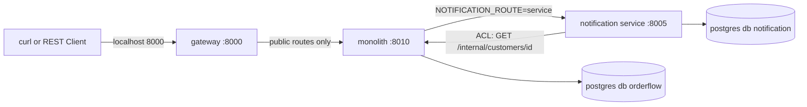

# Phase 1 — Decomposition

- **Status:** 🟨 in progress (step 1 ✅, step 2 next)
- **Mode:** COACH (the learner writes the code; Claude guides and reviews; see `CLAUDE.md` → Modes)
- **Roadmap:** `docs/ROADMAP.md` → Phase 1
- **Patterns:** Decompose by Business Capability, Decompose by Subdomain, Strangler Fig, Anti-Corruption Layer
  (and the API Gateway, first version)

---

## 1. The problem this phase solves (in this codebase)

The monolith works, but everything scales, deploys and fails as one unit. Phase 1 extracts the first service
**without changing anything a client can see**:

- a **gateway** gives clients one stable address while the backend changes behind it;
- a **Strangler Fig** switch (`NOTIFICATION_ROUTE=monolith|service`) swaps the old and new implementations
  with an env var, with no big-bang cutover;
- an **Anti-Corruption Layer** stops the monolith's legacy customer names (`cust_nm`, `cust_eml`) leaking
  into the new service.

**Why notification first:** nothing depends on it, it only reads customer data, and a mistake costs an
email, not money. It's the lowest-risk cut.

**What this phase breaks on purpose:** notification changes from a function call inside the order
transaction to a network call. When the notification service is down, placing an order fails, even though
the email has nothing to do with whether the order is valid. Phase 3 fixes this.

---

## 2. Target architecture at the end of Phase 1


(Text version: the client calls the gateway on 8000. The gateway forwards public routes to the monolith on
8010. With `NOTIFICATION_ROUTE=service`, the monolith calls the notification service on 8005. That service
calls the monolith's internal legacy customer endpoint through its ACL. Each app has its own database in the
same Postgres container.)

---

## 3. Steps

| # | Step | Main files | Tests (including failure paths) | Status |
|---|---|---|---|---|
| 1 | **Context map + ADR-0002 draft** (no code) | `docs/context-map.md`, `docs/adr/0002-decomposition.md` | none | ✅ |
| 2 | **Gateway** (split into 2a–2c, about an hour each): the single front door on :8000; the monolith moves to :8010 | see 2a–2c | see 2a–2c | ⬜ |
| 2a | ↳ **Gateway app + unit tests**: a small FastAPI app that forwards public routes (`/products`, `/orders`, `/admin`) to the monolith with httpx, passes `X-Correlation-ID` through, and hides everything else | `gateway/` (new workspace member), root `pyproject.toml` | Unit: forwarded paths reach the monolith (faked with httpx's `MockTransport`); `/internal/...` and unknown paths → 404; monolith unreachable → 502 | ⬜ |
| 2b | ↳ **Docker + Compose**: a Dockerfile for the gateway; the gateway takes host port 8000, the monolith moves to 8010 | `gateway/Dockerfile`, `infra/compose/docker-compose.yml`, `Makefile`, `.env.example` | `make up`: both healthy; `curl localhost:8000/products` goes through the gateway | ⬜ |
| 2c | ↳ **First end-to-end tests**: the Phase 0 flows run against the real stack through the gateway | `tests/e2e/` | E2E (`make e2e`): order SHIPPED, insufficient funds REJECTED, unknown order 404; the `.http` files still work unchanged | ⬜ |
| 3 | **Notification service**: own database and DB user (same Postgres container), own migrations, health endpoints, `POST /notifications`. Adds the legacy `GET /internal/customers/{id}` to the monolith (from the parking lot) | `services/notification/`, `infra/compose/init-db.sql`, monolith customer API | Component: a notification is stored; malformed request → 422; legacy endpoint: unknown customer → 404 | ⬜ |
| 4 | **ACL**: the single adapter in the notification service that maps `{cust_id, cust_nm, cust_eml}` to a clean `Recipient(name, email)` | `services/notification/src/notification/infra/customer_acl.py` | Unit: mapping; missing or unknown customer. **Guard test:** fails if legacy names appear outside `monolith/` and that one file | ⬜ |
| 5 | **Strangler switch** `NOTIFICATION_ROUTE=monolith\|service` inside the monolith's notification module. The order module doesn't change | `monolith/src/monolith/modules/notification/service.py`, new HTTP client in its `infra/` | Component: both routes give the same order response; the `service` route makes the HTTP call (tested with httpx's built-in `MockTransport`, no new library) | ⬜ |
| 6 | **Break it, then demo and docs**: stop notification, place an order, record exactly what happens; `phase-1.sh`; finish ADR-0002; update PROGRESS, catalogue and test docs | `scripts/demo/phase-1.sh`, `tests/e2e/`, docs | E2E: the documented failure with notification down | ⬜ |

Legend: ⬜ not started · 🟨 in progress · ✅ done (Definition of Done met, commands run by Claude)

---

## 4. Decisions (agreed before starting)

**Way of working (2026-09-29):** COACH mode. The learner writes all Python code **and tests**; setup files are
typed by the learner from full content given in the card; the learner drafts the context map and the ADR's
reasoning, and Claude reviews.

1. **The HTTP call stays exactly where the function call is now: inside the order transaction.** That's the
   faithful Strangler swap, and it's what makes the break-it visible. ADR-0002 will record two new problems,
   both fixed in later phases:
   - an email can be sent for an order that then rolls back;
   - the database transaction stays open while waiting on the network.
2. **Circular call:** monolith → notification → monolith (customer lookup). A known smell, recorded in the
   ADR; it goes away when customer is extracted in Phase 5.
3. **No explicit timeouts yet** (they arrive in Phase 3). httpx has a **5-second default timeout**, so a stopped
   notification service most likely gives a ~5 s wait and then a 500, not an endless hang. We keep the default
   and record what actually happens.
4. **"Own database"** = a separate database and user in the same Postgres container (keeps the laptop setup
   light, C9). Phase 2 proves one service can't read another's database.
5. **The monolith's `/health/ready` doesn't check notification.** Dependency-aware readiness is Phase 3.

---

## 5. Acceptance criteria (from ROADMAP) and planned evidence

| Criterion | Planned evidence |
|---|---|
| All Phase 0 `.http` requests and tests still pass through the gateway | `make test` (65+), `make e2e` against `localhost:8000`, `.http` files unchanged |
| Legacy field names appear only in the ACL module | Guard test (step 4), run in `make test` |
| ADR-0002 records the decomposition approach and why notification was extracted first | `docs/adr/0002-decomposition.md` |
| Demo shows identical client responses with both route toggles, then the failure with notification stopped | `make clean && make up && make demo-1` |

---

## 6. Step cards

Claude writes each step's card here when the step starts, so the instructions survive `/clear`.
Card format: see `CLAUDE.md` → Modes → `MODE: COACH`.

### Step 1 — Context map + ADR-0002 draft (you write; Claude reviews)

**Goal:** be able to explain *where* the service boundaries are and *why* notification is extracted first,
before touching any code. Patterns: Decompose by Business Capability, Decompose by Subdomain (and it sets up
Strangler Fig and ACL for later steps). Time: about 1 hour.

**Predict first (one line, in chat):** which module do you think has the **most** other modules depending on
it, and which has the **fewest**? Then check with the command in A3.

#### Files you create
| File | How to start it |
|---|---|
| `docs/context-map.md` | already created with the skeleton below (headings and empty tables); fill it in |
| `docs/adr/0002-decomposition.md` | `cp docs/adr/0000-template.md docs/adr/0002-decomposition.md` |

#### Vocabulary (short)
- **Business capability:** something the business *does*, e.g. "take payments", "ship goods". Stable over years.
- **Subdomain:** a part of the problem space, classed as:
  - **core**: why the business exists and where it competes;
  - **supporting**: needed and specific to us, but not a differentiator;
  - **generic**: a commodity you could buy (think: would you pay a SaaS for it?).
- **Bounded context:** a boundary inside which one model and its words have exactly one meaning.
- **Upstream / downstream:** upstream *provides*, downstream *consumes* and is affected by upstream changes.
- **Relationship types** on a context map:
  - **Customer/Supplier**: the downstream's needs influence the upstream's plans.
  - **Conformist**: the downstream simply adopts the upstream's model as it is.
  - **Anti-Corruption Layer (ACL)**: the downstream translates the upstream's model at the border so it doesn't leak in.
  - **Open Host Service / Published Language**: the upstream offers a stable, documented interface to everyone.
  - **Shared Kernel**: two contexts share a small piece of model or code.

#### Part A — `docs/context-map.md` (use this skeleton)
```markdown
# OrderFlow context map

## 1. Bounded contexts
| Context | Capability (3–5 words) | Subdomain type + why (one line) | Owns data (tables) | Today (module) | Service from phase |
|---|---|---|---|---|---|

## 2. Relationships
| Upstream | Downstream | What flows (call and data) | Relationship type | Why this type |
|---|---|---|---|---|

## 3. Diagram
(mermaid flowchart LR, an arrow from upstream to downstream, labelled with the relationship type)

## 4. Capability vs subdomain: where the two cuts agree and differ

## 5. Open questions
```

Guiding questions:
- **A1.** For each of the six modules: what does the business do there, in 3–5 words? (Ignore the code; think
  about a real shop.)
- **A2.** Which context is the reason OrderFlow exists (core)? Which could you buy off the shelf (generic)?
  Write one line of reasoning for each; there's no single right answer, but there are wrong reasons.
- **A3.** Every `import … service as …` between modules is a dependency. List them:
  ```bash
  grep -rn --include=*.py "import service as" monolith/src/monolith/modules
  ```
  For each line, which module is upstream and which is downstream? Every line must appear in section 2.
- **A4.** The customer context stores legacy names (`cust_nm`, `cust_eml`). Which contexts are downstream of it?
  Today, which relationship type are they in (look at `notification/service.py`)? Which type do we *want* after
  Phase 1, and why?
- **A5.** Data ownership: take the table list from `monolith/migrations/versions/0001…` and `0003…`. Does any
  table belong to two contexts? (If yes, that's a boundary problem.)
- **A6.** (Roadmap self-check) If you cut by **subdomain** instead of **capability**, would any contexts merge
  or split? Try "checkout" (order + payment?) or "fulfilment" (shipping + notification?). Write where the two
  cuts agree and where they differ, and which you'd choose here.

Diagram tip: keep Mermaid simple (no `subgraph`, no `;` in labels). Preview with `Ctrl+K V`.

#### Part B — `docs/adr/0002-decomposition.md` (draft three sections only)
Fill in: **Status:** Proposed · **Phase:** 1 · **Date** · **Pattern(s):** Decompose by Business Capability,
Decompose by Subdomain, Strangler Fig, Anti-Corruption Layer.

- **Context:** why decompose at all? Be honest: at our size, what actually hurts in the monolith today, and what
  *would* hurt with 5 teams and 100× traffic? (It's fine to write "nothing hurts yet; we do it to learn".)
- **Options considered:** a table with **at least three candidates for the first extraction** (e.g.
  notification, inventory, payment, customer). Judge each on:
  1. how many other modules call it (from A3);
  2. whether it needs data it doesn't own;
  3. whether it sits inside the money/stock part of the transaction (the savepoint in `order/service.py`);
  4. what the worst case is if the extraction has a bug.
- **Decision:** 3–6 sentences: why notification first, and why a Strangler Fig toggle is safer than switching
  over all at once.

Leave **Consequences** and **Learnings** empty; they're written in step 6 from what actually happens.

#### Verify
No code, so no tests. Check that both files render in the Markdown preview (`Ctrl+K V`), including your diagram.

#### Done when
- [ ] `context-map.md` has all five sections and six contexts, and every line from the A3 command appears as a
      relationship.
- [ ] ADR-0002 has Context, Options (three or more candidates) and Decision drafted, with Status: Proposed.
- [ ] You can say out loud, in three sentences, why notification goes first.
- [ ] Say `done`. Claude reviews against the brief and the code (e.g. do your dependencies match the imports?),
      then you commit:
      `git add docs && git commit -m "docs(phase-1): context map and ADR-0002 draft"`


---

## 7. Phase log

| Date | Event |
|---|---|
| 2026-09-29 | Plan written; working mode changed to COACH |
| 2026-09-29 | Step 1 ✅: context map (written by Claude on request) and ADR-0002 (Context, Options, Decision; written by Claude on request). Learner's summary: "minimal impact, especially no financial loss". Also recorded: no real email in any phase; Phase 10 (reporting + loyalty) planned |
