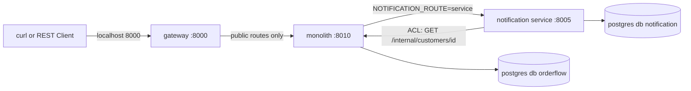

# Phase 1 — Decomposition

- **Status:** 🟨 in progress (step 1 ✅, step 2a ✅, step 2b next)
- **Mode:** COACH (the learner writes the code; Claude guides and reviews; see `CLAUDE.md` → Modes)
- **Roadmap:** `docs/ROADMAP.md` → Phase 1
- **Patterns:** Decompose by Business Capability, Decompose by Subdomain, Strangler Fig, Anti-Corruption Layer
  (and the API Gateway, first version)

---

## 1. The problem this phase solves (in this codebase)

The monolith works, but everything scales, deploys and fails as one unit. Phase 1 extracts the first service
**without changing anything a client can see**:

- a **gateway** gives clients one stable address while the backend changes behind it;
- a **Strangler Fig** switch (`NOTIFICATION_ROUTE=monolith|service`) swaps the old and new implementations
  with an env var, with no big-bang cutover;
- an **Anti-Corruption Layer** stops the monolith's legacy customer names (`cust_nm`, `cust_eml`) leaking
  into the new service.

**Why notification first:** nothing depends on it, it only reads customer data, and a mistake costs an
email, not money. It's the lowest-risk cut.

**What this phase breaks on purpose:** notification changes from a function call inside the order
transaction to a network call. When the notification service is down, placing an order fails, even though
the email has nothing to do with whether the order is valid. Phase 3 fixes this.

---

## 2. Target architecture at the end of Phase 1


(Text version: the client calls the gateway on 8000. The gateway forwards public routes to the monolith on
8010. With `NOTIFICATION_ROUTE=service`, the monolith calls the notification service on 8005. That service
calls the monolith's internal legacy customer endpoint through its ACL. Each app has its own database in the
same Postgres container.)

---

## 3. Steps

| # | Step | Main files | Tests (including failure paths) | Status |
|---|---|---|---|---|
| 1 | **Context map + ADR-0002 draft** (no code) | `docs/context-map.md`, `docs/adr/0002-decomposition.md` | none | ✅ |
| 2 | **Gateway** (split into 2a–2c, about an hour each): the single front door on :8000; the monolith moves to :8010 | see 2a–2c | see 2a–2c | 🟨 |
| 2a | ↳ **Gateway app + unit tests**: a small FastAPI app that forwards public routes (`/products`, `/orders`, `/admin`) to the monolith with httpx, passes `X-Correlation-ID` through, and hides everything else | `gateway/` (new workspace member), root `pyproject.toml` | Unit: forwarded paths reach the monolith (faked with httpx's `MockTransport`); `/internal/...` and unknown paths → 404; monolith unreachable → 502 | ✅ |
| 2b | ↳ **Docker + Compose**: a Dockerfile for the gateway; the gateway takes host port 8000, the monolith moves to 8010 | `gateway/Dockerfile`, `infra/compose/docker-compose.yml`, `Makefile`, `.env.example` | `make up`: both healthy; `curl localhost:8000/products` goes through the gateway | ⬜ |
| 2c | ↳ **First end-to-end tests**: the Phase 0 flows run against the real stack through the gateway | `tests/e2e/` | E2E (`make e2e`): order SHIPPED, insufficient funds REJECTED, unknown order 404; the `.http` files still work unchanged | ⬜ |
| 3 | **Notification service**: own database and DB user (same Postgres container), own migrations, health endpoints, `POST /notifications`. Adds the legacy `GET /internal/customers/{id}` to the monolith (from the parking lot) | `services/notification/`, `infra/compose/init-db.sql`, monolith customer API | Component: a notification is stored; malformed request → 422; legacy endpoint: unknown customer → 404 | ⬜ |
| 4 | **ACL**: the single adapter in the notification service that maps `{cust_id, cust_nm, cust_eml}` to a clean `Recipient(name, email)` | `services/notification/src/notification/infra/customer_acl.py` | Unit: mapping; missing or unknown customer. **Guard test:** fails if legacy names appear outside `monolith/` and that one file | ⬜ |
| 5 | **Strangler switch** `NOTIFICATION_ROUTE=monolith\|service` inside the monolith's notification module. The order module doesn't change | `monolith/src/monolith/modules/notification/service.py`, new HTTP client in its `infra/` | Component: both routes give the same order response; the `service` route makes the HTTP call (tested with httpx's built-in `MockTransport`, no new library) | ⬜ |
| 6 | **Break it, then demo and docs**: stop notification, place an order, record exactly what happens; `phase-1.sh`; finish ADR-0002; update PROGRESS, catalogue and test docs | `scripts/demo/phase-1.sh`, `tests/e2e/`, docs | E2E: the documented failure with notification down | ⬜ |

Legend: ⬜ not started · 🟨 in progress · ✅ done (Definition of Done met, commands run by Claude)

---

## 4. Decisions (agreed before starting)

**Way of working (2026-09-29):** COACH mode. The learner writes all Python code **and tests**; setup files are
typed by the learner from full content given in the card; the learner drafts the context map and the ADR's
reasoning, and Claude reviews.

1. **The HTTP call stays exactly where the function call is now: inside the order transaction.** That's the
   faithful Strangler swap, and it's what makes the break-it visible. ADR-0002 will record two new problems,
   both fixed in later phases:
   - an email can be sent for an order that then rolls back;
   - the database transaction stays open while waiting on the network.
2. **Circular call:** monolith → notification → monolith (customer lookup). A known smell, recorded in the
   ADR; it goes away when customer is extracted in Phase 5.
3. **No explicit timeouts yet** (they arrive in Phase 3). httpx has a **5-second default timeout**, so a stopped
   notification service most likely gives a ~5 s wait and then a 500, not an endless hang. We keep the default
   and record what actually happens.
4. **"Own database"** = a separate database and user in the same Postgres container (keeps the laptop setup
   light, C9). Phase 2 proves one service can't read another's database.
5. **The monolith's `/health/ready` doesn't check notification.** Dependency-aware readiness is Phase 3.

---

## 5. Acceptance criteria (from ROADMAP) and planned evidence

| Criterion | Planned evidence |
|---|---|
| All Phase 0 `.http` requests and tests still pass through the gateway | `make test` (65+), `make e2e` against `localhost:8000`, `.http` files unchanged |
| Legacy field names appear only in the ACL module | Guard test (step 4), run in `make test` |
| ADR-0002 records the decomposition approach and why notification was extracted first | `docs/adr/0002-decomposition.md` |
| Demo shows identical client responses with both route toggles, then the failure with notification stopped | `make clean && make up && make demo-1` |

---

## 6. Step cards

Claude writes each step's card here when the step starts, so the instructions survive `/clear`.
Card format: see `CLAUDE.md` → Modes → `MODE: COACH`.

### Step 1 — Context map + ADR-0002 draft (you write; Claude reviews)

**Goal:** be able to explain *where* the service boundaries are and *why* notification is extracted first,
before touching any code. Patterns: Decompose by Business Capability, Decompose by Subdomain (and it sets up
Strangler Fig and ACL for later steps). Time: about 1 hour.

**Predict first (one line, in chat):** which module do you think has the **most** other modules depending on
it, and which has the **fewest**? Then check with the command in A3.

#### Files you create
| File | How to start it |
|---|---|
| `docs/context-map.md` | already created with the skeleton below (headings and empty tables); fill it in |
| `docs/adr/0002-decomposition.md` | `cp docs/adr/0000-template.md docs/adr/0002-decomposition.md` |

#### Vocabulary (short)
- **Business capability:** something the business *does*, e.g. "take payments", "ship goods". Stable over years.
- **Subdomain:** a part of the problem space, classed as:
  - **core**: why the business exists and where it competes;
  - **supporting**: needed and specific to us, but not a differentiator;
  - **generic**: a commodity you could buy (think: would you pay a SaaS for it?).
- **Bounded context:** a boundary inside which one model and its words have exactly one meaning.
- **Upstream / downstream:** upstream *provides*, downstream *consumes* and is affected by upstream changes.
- **Relationship types** on a context map:
  - **Customer/Supplier**: the downstream's needs influence the upstream's plans.
  - **Conformist**: the downstream simply adopts the upstream's model as it is.
  - **Anti-Corruption Layer (ACL)**: the downstream translates the upstream's model at the border so it doesn't leak in.
  - **Open Host Service / Published Language**: the upstream offers a stable, documented interface to everyone.
  - **Shared Kernel**: two contexts share a small piece of model or code.

#### Part A — `docs/context-map.md` (use this skeleton)
```markdown
# OrderFlow context map

## 1. Bounded contexts
| Context | Capability (3–5 words) | Subdomain type + why (one line) | Owns data (tables) | Today (module) | Service from phase |
|---|---|---|---|---|---|

## 2. Relationships
| Upstream | Downstream | What flows (call and data) | Relationship type | Why this type |
|---|---|---|---|---|

## 3. Diagram
(mermaid flowchart LR, an arrow from upstream to downstream, labelled with the relationship type)

## 4. Capability vs subdomain: where the two cuts agree and differ

## 5. Open questions
```

Guiding questions:
- **A1.** For each of the six modules: what does the business do there, in 3–5 words? (Ignore the code; think
  about a real shop.)
- **A2.** Which context is the reason OrderFlow exists (core)? Which could you buy off the shelf (generic)?
  Write one line of reasoning for each; there's no single right answer, but there are wrong reasons.
- **A3.** Every `import … service as …` between modules is a dependency. List them:
  ```bash
  grep -rn --include=*.py "import service as" monolith/src/monolith/modules
  ```
  For each line, which module is upstream and which is downstream? Every line must appear in section 2.
- **A4.** The customer context stores legacy names (`cust_nm`, `cust_eml`). Which contexts are downstream of it?
  Today, which relationship type are they in (look at `notification/service.py`)? Which type do we *want* after
  Phase 1, and why?
- **A5.** Data ownership: take the table list from `monolith/migrations/versions/0001…` and `0003…`. Does any
  table belong to two contexts? (If yes, that's a boundary problem.)
- **A6.** (Roadmap self-check) If you cut by **subdomain** instead of **capability**, would any contexts merge
  or split? Try "checkout" (order + payment?) or "fulfilment" (shipping + notification?). Write where the two
  cuts agree and where they differ, and which you'd choose here.

Diagram tip: keep Mermaid simple (no `subgraph`, no `;` in labels). Preview with `Ctrl+K V`.

#### Part B — `docs/adr/0002-decomposition.md` (draft three sections only)
Fill in: **Status:** Proposed · **Phase:** 1 · **Date** · **Pattern(s):** Decompose by Business Capability,
Decompose by Subdomain, Strangler Fig, Anti-Corruption Layer.

- **Context:** why decompose at all? Be honest: at our size, what actually hurts in the monolith today, and what
  *would* hurt with 5 teams and 100× traffic? (It's fine to write "nothing hurts yet; we do it to learn".)
- **Options considered:** a table with **at least three candidates for the first extraction** (e.g.
  notification, inventory, payment, customer). Judge each on:
  1. how many other modules call it (from A3);
  2. whether it needs data it doesn't own;
  3. whether it sits inside the money/stock part of the transaction (the savepoint in `order/service.py`);
  4. what the worst case is if the extraction has a bug.
- **Decision:** 3–6 sentences: why notification first, and why a Strangler Fig toggle is safer than switching
  over all at once.

Leave **Consequences** and **Learnings** empty; they're written in step 6 from what actually happens.

#### Verify
No code, so no tests. Check that both files render in the Markdown preview (`Ctrl+K V`), including your diagram.

#### Done when
- [ ] `context-map.md` has all five sections and six contexts, and every line from the A3 command appears as a
      relationship.
- [ ] ADR-0002 has Context, Options (three or more candidates) and Decision drafted, with Status: Proposed.
- [ ] You can say out loud, in three sentences, why notification goes first.
- [ ] Say `done`. Claude reviews against the brief and the code (e.g. do your dependencies match the imports?),
      then you commit:
      `git add docs && git commit -m "docs(phase-1): context map and ADR-0002 draft"`


### Step 2a — Gateway app + unit tests (you write the code; Claude reviews)

**Goal:** build the **API Gateway**: one front door that every client talks to. It passes public requests on
to the monolith and refuses everything else. Clients will keep using `localhost:8000` while services move
around behind it. That's what lets us extract notification (and, later, other services) without clients
noticing. In 2a the gateway runs only in tests; 2b puts it in Docker.

Time: about 1–1.5 hours.

**Predict first (one line, in chat):** the monolith has an internal route planned for step 3,
`/internal/customers/{id}`. If the gateway simply forwarded *every* path, what could an outside client do
that it shouldn't?

#### What the gateway does, in plain words
```
client ──► gateway (:8000) ──► monolith
             │
             ├─ path starts with /products, /orders or /admin?  → pass it on, return the monolith's answer as it is
             ├─ /health/live or /health/ready?                  → the gateway answers itself
             ├─ anything else (e.g. /internal/..., /nope)?      → 404, the monolith never sees it
             └─ monolith unreachable?                           → 502 "upstream unavailable"
```
"Upstream" here means the service behind the gateway (the monolith). **502 Bad Gateway** is the standard
status for "I'm a gateway, and the service behind me didn't answer".

#### Files

| File | New or change | Who writes it |
|---|---|---|
| `gateway/pyproject.toml` | new | you type it (full content below) |
| `gateway/src/gateway/__init__.py` | new | you: one docstring line. **Don't skip it:** without it Python still imports the folder, but mypy treats `gateway` as an untyped third-party package and `make lint` fails with "Skipping analyzing gateway.…" |
| `gateway/src/gateway/config.py` | new | you (spec below) |
| `gateway/src/gateway/routing.py` | new | you (spec below) |
| `gateway/src/gateway/proxy.py` | new | you (spec below) |
| `gateway/src/gateway/main.py` | new | you (spec below) |
| `gateway/tests/__init__.py`, `gateway/tests/unit/__init__.py` | new | empty files |
| `gateway/tests/unit/test_routing.py` | new | you (test list below) |
| `gateway/tests/unit/test_proxy.py` | new | you (test list below) |
| `pyproject.toml` (repo root) | change | you (exact edits below) |
| `Makefile` | change | you (one line) |

> **Order matters (we hit this in Phase 0):** create the `gateway/src/gateway/*.py` files **before** running
> `uv sync`. If you sync first, uv installs an empty package and imports fail with `ModuleNotFoundError`. The fix
> is `uv sync --reinstall-package gateway`.

#### Setup files (type these exactly)

**`gateway/pyproject.toml`** (same pattern as `monolith/pyproject.toml`):
```toml
[project]
name = "gateway"
version = "0.1.0"
description = "OrderFlow API gateway: the single entry point for clients"
requires-python = ">=3.12,<3.13"
dependencies = [
    "orderflow-common",
    "fastapi>=0.115",
    "uvicorn[standard]>=0.30",
    "httpx>=0.27",
    "pydantic-settings>=2.4",
]

[tool.uv.sources]
orderflow-common = { workspace = true }

[build-system]
requires = ["hatchling"]
build-backend = "hatchling.build"

[tool.hatch.build.targets.wheel]
packages = ["src/gateway"]
```
- `dependencies`: what the gateway needs at runtime. `orderflow-common` gives us the correlation-ID middleware
  and logging; `httpx` is the HTTP client that calls the monolith.
- `[tool.uv.sources]`: "get `orderflow-common` from this workspace (`libs/common`), not from the internet".
- `[tool.hatch...] packages`: where the importable code lives, so `import gateway` works.

**Root `pyproject.toml`**: five small edits.
1. `members = ["libs/common", "monolith"]` → `members = ["libs/common", "monolith", "gateway"]`
2. Under `[tool.uv.sources]`, add the line `gateway = { workspace = true }`
3. In `[dependency-groups] dev = [ ... ]`, add `"gateway",` after `"monolith",`
4. In `[tool.ruff.lint.isort]`: `known-first-party = ["monolith", "orderflow_common", "gateway"]`
5. In `[tool.pytest.ini_options]`: `testpaths = ["monolith/tests", "libs/common/tests", "gateway/tests"]`

Why: 1 tells uv the gateway is part of this project; 2 and 3 install it into `.venv` so tests can import it;
4 makes ruff sort `import gateway…` together with our own packages; 5 makes `make test` run the gateway tests.

**`Makefile`**: in the `lint:` target, change the mypy line to
`uv run mypy libs/common/src monolith/src gateway/src`, so the gateway is type-checked too.

Then run `uv sync` (after creating the source files).

#### Code spec

**`gateway/src/gateway/config.py`**: start from a copy of `monolith/src/monolith/config.py`, then change the fields:

| Monolith field | In the gateway |
|---|---|
| `service_name` | **keep**, default `"gateway"` |
| `log_level` | **keep** as is |
| `database_url`, `currency`, `db_ready_timeout_s`, `atomic_stock_reservation` (and their comments) | **delete**: the gateway has no database and no business rules |
| — | **add** `monolith_url` (only the gateway calls the monolith, so only it needs this) |

Also delete `from pydantic import Field`, which is no longer used (`make lint` would flag it).

- `class Settings(BaseSettings)` with `model_config = SettingsConfigDict(env_file=".env", extra="ignore")` and fields:

  | Field | Type | Default | Meaning |
  |---|---|---|---|
  | `service_name` | `str` | `"gateway"` | used in logs |
  | `monolith_url` | `str` | **none (required)** | base URL of the monolith, e.g. `http://monolith:8010` (env var `MONOLITH_URL`) |
  | `log_level` | `str` | `"INFO"` | |

- `get_settings() -> Settings`, decorated with `@lru_cache`, returns `Settings()`.
- Don't give `monolith_url` a default: a missing value should stop the gateway at startup, not send traffic somewhere wrong.

**`gateway/src/gateway/routing.py`**: pure Python, no FastAPI or httpx imports.
- Constant `PUBLIC_PREFIXES: tuple[str, ...] = ("/products", "/orders", "/admin")`
- `def resolve_upstream(path: str, routes: Mapping[str, str]) -> str | None`
  - `routes` maps a path prefix to the upstream base URL, e.g. `{"/orders": "http://monolith:8010", ...}`.
  - Logic:
    1. For each `prefix, upstream` in `routes.items()`:
    2. if `path == prefix` **or** `path.startswith(prefix + "/")`: return `upstream`.
    3. After the loop, return `None` (not a public route).
  - **Don't** use plain `path.startswith(prefix)`: then `/ordersXYZ` would match `/orders`.
  - Why a table and not just `if path in (...)`: in Phase 2, `/products` will point at the new inventory service
    while `/orders` still points at the monolith. Then only the table changes.

**`gateway/src/gateway/proxy.py`**: the forwarding logic.
- Constants (all lowercase):
  ```python
  HOP_BY_HOP = frozenset(
      {
          "connection",
          "keep-alive",
          "proxy-authenticate",
          "proxy-authorization",
          "te",
          "trailers",
          "transfer-encoding",
          "upgrade",
      }
  )
  REQUEST_HEADERS_TO_DROP = HOP_BY_HOP | {"host", "content-length", "x-correlation-id"}
  RESPONSE_HEADERS_TO_DROP = HOP_BY_HOP | {"content-length", "content-encoding"}
  ```
  Why: "hop-by-hop" headers describe *one* network connection (client ↔ gateway), so they must not be copied to
  the next one (gateway ↔ monolith). `host` must be the monolith's own name, not `localhost:8000`, and httpx sets
  it for us. `content-length` is recalculated for the new message. The incoming `x-correlation-id` is dropped because `forward()` sets the validated one instead; copying both would send **two** correlation headers (found in review, 2026-09-30). `content-encoding` is dropped because httpx
  already unzips the body.
- `def filter_headers(headers: Iterable[tuple[str, str]], drop: frozenset[str]) -> dict[str, str]`
  - Returns a new dict with every `(name, value)` whose `name.lower()` is **not** in `drop`.
  - (Limitation we accept: a header that appears twice, like two `set-cookie`s, keeps only the last. We have none.)
- `async def forward(client: httpx.AsyncClient, request: fastapi.Request, upstream_base: str) -> fastapi.Response`
  1. Build the target URL: `upstream_base.rstrip("/") + request.url.path`; if `request.url.query` isn't empty,
     add `"?" + request.url.query`.
  2. `headers = filter_headers(request.headers.items(), REQUEST_HEADERS_TO_DROP)`.
  3. `cid = get_correlation_id()` (from `orderflow_common.correlation`); if it isn't `None`, set
     `headers["X-Correlation-ID"] = cid`. The middleware has already validated or created it, so use this value,
     not the raw incoming header.
  4. `body = await request.body()`.
  5. `upstream = await client.request(request.method, url, headers=headers, content=body)`, inside
     `try: … except httpx.TransportError as exc:`. On error, log a warning (`structlog`, event
     `"upstream_unavailable"` with `upstream=upstream_base, error=repr(exc)`) and return
     `JSONResponse(status_code=502, content={"detail": "upstream unavailable"})`.
  6. Return `Response(content=upstream.content, status_code=upstream.status_code,
     headers=filter_headers(upstream.headers.items(), RESPONSE_HEADERS_TO_DROP))`.
  - **Don't** call `upstream.raise_for_status()`: a 404 or 422 from the monolith is a *valid answer* and must
    reach the client unchanged. Only "no answer at all" becomes 502.
  - **Don't** catch plain `Exception`: a bug in our code must show up as a 500, not be disguised as "monolith down".
  - **Don't** set a timeout yet. Explicit timeouts are Phase 3's pattern; until then httpx's default (5 seconds)
    applies.
  - `httpx.TransportError` covers connection refused, DNS failure and timeouts (checked in httpx 0.28.1).

**`gateway/src/gateway/main.py`**: builds the app, like `monolith/src/monolith/main.py`.
- Imports (exact modules; `orderflow_common` has no `middleware` or `settings` module):
  ```python
  from collections.abc import AsyncGenerator
  from contextlib import asynccontextmanager

  import httpx
  from fastapi import FastAPI, Request, Response
  from fastapi.responses import JSONResponse

  from gateway.config import Settings, get_settings  # the gateway's own settings
  from gateway.proxy import forward
  from gateway.routing import PUBLIC_PREFIXES, resolve_upstream
  from orderflow_common.correlation import CorrelationIdMiddleware
  from orderflow_common.logging import configure_logging
  ```
- `def create_app(settings: Settings | None = None, upstream_transport: httpx.AsyncBaseTransport | None = None) -> FastAPI`
  - `upstream_transport` exists **only for tests**: they pass a fake monolith. In production it stays `None`, and
    httpx uses the real network.
  - Logic:
    1. `settings = settings or get_settings()`; call `configure_logging(settings.service_name, settings.log_level)`.
    2. Build the route table: `routes = {prefix: settings.monolith_url for prefix in PUBLIC_PREFIXES}`.
    3. Define `async def lifespan(app: FastAPI) -> AsyncGenerator[None, None]` with `@asynccontextmanager` (as in
       the monolith). Use `AsyncGenerator`, not `AsyncIterator`: newer type stubs (Pylance 2026) mark
       `@asynccontextmanager` + `AsyncIterator` as deprecated. Then: create `httpx.AsyncClient(transport=upstream_transport)`, store it as `app.state.client`,
       `yield`, then `await client.aclose()` in a `finally`.
    4. `app = FastAPI(title="OrderFlow gateway", version="0.1.0", lifespan=lifespan)`;
       `app.add_middleware(CorrelationIdMiddleware)`.
    5. Health routes, **registered before the catch-all**: `GET /health/live` and `GET /health/ready`, each an
       `async def ...() -> dict[str, str]` returning `{"status": "ok"}`. The gateway doesn't check the monolith here; readiness that depends on other services
       is a Phase 3 topic.
    6. The catch-all route:
       `@app.api_route("/{path:path}", methods=["GET", "POST", "PUT", "PATCH", "DELETE"])`
       `async def proxy(request: Request, path: str) -> Response:`
       - `upstream = resolve_upstream(request.url.path, routes)`
       - if `upstream is None`: return `JSONResponse(status_code=404, content={"detail": "not found"})`
       - otherwise: `client: httpx.AsyncClient = request.app.state.client` (the type hint tells mypy what
         `app.state` holds), then `return await forward(client, request, upstream)`
       - `path` is unused (we read `request.url.path`, which keeps the leading `/`), but it must stay in the
         signature because it's part of the route pattern.
    7. `return app`
  - Why the health routes come first: FastAPI tries routes in the order they were added. If the catch-all came
    first, it would also catch `/health/live`.

#### Tests (you write them)

**`gateway/tests/unit/test_routing.py`**: plain functions; use a small `routes` dict such as
`{"/orders": "http://m", "/products": "http://m", "/admin": "http://m"}`.

| Test | Asserts |
|---|---|
| `test_exact_prefix_is_routed` | `resolve_upstream("/orders", routes) == "http://m"` |
| `test_sub_path_is_routed` | `/orders/123/cancel` and `/admin/products/x/stock` are routed |
| `test_lookalike_prefix_is_not_routed` | `/ordersXYZ` → `None` (**failure path**) |
| `test_internal_path_is_not_routed` | `/internal/customers/abc` → `None` (**failure path**) |
| `test_root_and_unknown_paths_are_not_routed` | `/` and `/nope` → `None` |

**`gateway/tests/unit/test_proxy.py`**: the whole gateway app, with a **fake monolith**.

Test plumbing: look at `monolith/tests/helpers.py` for the same pattern.
- Write a helper `gateway_client(handler)`, an `@asynccontextmanager` returning
  `AsyncGenerator[httpx.AsyncClient, None]` (not `AsyncIterator`, for the same reason as `lifespan`), that:
  1. builds `app = create_app(Settings(monolith_url="http://monolith.test"), upstream_transport=httpx.MockTransport(handler))`;
  2. starts its lifespan with `async with app.router.lifespan_context(app)`;
  3. yields an `httpx.AsyncClient(transport=httpx.ASGITransport(app=app), base_url="http://gateway.test")`.
- `handler` is a plain function `(request: httpx.Request) -> httpx.Response` playing the monolith. Have it append
  each request to a list, so tests can check what the "monolith" received.
- There are **two** fake transports: `ASGITransport` (the test → the gateway) and `MockTransport` (the gateway → the
  fake monolith). No network and no Docker are involved.

| Test | Fake monolith does | Asserts |
|---|---|---|
| `test_get_is_forwarded_with_path_and_query` | returns 200 `{"ok": true}` | `GET /products/abc?x=1` → the recorded URL is `http://monolith.test/products/abc?x=1`, method GET; the client gets 200 and the same JSON |
| `test_post_body_and_status_are_passed_through` | returns 201 | `POST /orders` with a JSON body → the recorded body equals what was sent; the client gets 201 |
| `test_upstream_error_status_is_not_changed` | returns 422 `{"detail": "bad"}` | the client gets **422** and the same body, not 502 (**failure path**) |
| `test_correlation_id_goes_upstream_and_back` | returns 200 | sent with `X-Correlation-ID: <a uuid>` → the recorded request has the same header; the response has it too |
| `test_malformed_correlation_id_is_replaced_not_duplicated` | returns 200 | sent with `X-Correlation-ID: garbage` → `recorded.headers.get_list("x-correlation-id")` has **exactly one** value, and it isn't `garbage` (**failure path**) |
| `test_host_header_is_the_monolith` | returns 200 | the recorded request's `host` header is `monolith.test` |
| `test_internal_path_is_404_and_never_forwarded` | (must not be called) | `GET /internal/customers/x` → 404; the recorded list is **empty** (**failure path**) |
| `test_unknown_path_is_404` | (must not be called) | `GET /nope` → 404 |
| `test_unreachable_monolith_gives_502` | raises `httpx.ConnectError("refused", request=request)` | 502 with `{"detail": "upstream unavailable"}` (**failure path**) |
| `test_health_live_does_not_call_the_monolith` | (must not be called) | `GET /health/live` → 200; the recorded list is empty |

#### Verify
```bash
uv sync                                     # after creating the source files
uv run pytest gateway -q                    # expect: 15 passed
make test                                   # expect: 80 passed (65 existing + 15 new)
make lint                                   # expect: all clean, and mypy now also checks gateway/src
```
Optional, to see it work for real: with the stack running (`make up`, monolith on 8000 for now), start the gateway
on port 8001 and go through it:
```bash
MONOLITH_URL=http://localhost:8000 uv run uvicorn gateway.main:create_app --factory --port 8001
# in a second terminal:
curl -s localhost:8001/products | head -c 200; echo       # products, via the gateway
curl -s -w ' HTTP %{http_code}\n' localhost:8001/internal/x  # {"detail":"not found"} HTTP 404
```
(Stop the gateway with `Ctrl+C`.)

#### Done when
- [ ] All files above exist; `uv sync` ran after the source files were created.
- [ ] `uv run pytest gateway -q` shows 15 passed, including the five failure paths.
- [ ] `make test` and `make lint` pass.
- [ ] You can explain: why `/ordersXYZ` must not match; why a 422 from the monolith must *not* become 502; and why
      `host` isn't copied.
- [ ] Say `done`. Claude runs the checks and reviews your code, then you commit:
      `git add -A && git commit -m "feat(phase-1): gateway app with unit tests (step 2a)"`

#### Answers to the "you can explain" questions

**1. Why must `/ordersXYZ` not be forwarded?**
Only `/orders` itself and paths *under* it (`/orders/...`) are public. `/ordersXYZ` is a different path that
merely starts with the same letters. If the gateway used a plain "starts with `/orders`" check, any path
beginning with those letters would slip through to the monolith, including routes we never meant to expose
(e.g. a future `/orders-admin-tools`). The gateway is the security boundary, so it must match whole path
segments: exactly `/orders`, or `/orders` followed by `/`. Test: `test_lookalike_prefix_is_not_routed`.

**2. Why must a 422 from the monolith stay 422, and not become 502?**
A 422 is a **real answer** from the monolith: "I received your request, and it's invalid" (e.g. quantity 0).
The client needs that exact status and message to fix its request. 502 means something different: "the
gateway couldn't get any answer from the service behind it" (it's down or unreachable). Turning a 422 into
a 502 would hide the real problem and make a healthy monolith look broken, so clients might retry a request
that can never succeed. The rule: pass every answer through unchanged; only "no answer at all" becomes 502.
Tests: `test_upstream_error_status_is_not_changed` and `test_unreachable_monolith_gives_502`.

**3. Why isn't the client's `host` header copied to the monolith?**
`Host` says which server the request is addressed to. The client addressed the **gateway**
(`localhost:8000`), but the gateway's onward request goes to a different server, the **monolith**
(`monolith:8010`). Copying the client's `Host` would send the monolith a request addressed to someone else.
That can break servers that check the host or use it to build links, and it's simply wrong information.
httpx fills in the correct `Host` from the URL it calls. Test: `test_host_header_is_the_monolith`.


---

## 7. Phase log

| Date | Event |
|---|---|
| 2026-09-29 | Plan written; working mode changed to COACH |
| 2026-09-29 | Step 1 ✅: context map (written by Claude on request) and ADR-0002 (Context, Options, Decision; written by Claude on request). Learner's summary: "minimal impact, especially no financial loss". Also recorded: no real email in any phase; Phase 10 (reporting + loyalty) planned |
| 2026-09-30 | Step 2a ✅: gateway app (config, routing, proxy, main) + 15 unit tests; `make test` 80 passed, `make lint` clean. Review found and fixed: duplicate correlation header, wrong imports, missing `__init__.py`, `AsyncIterator` → `AsyncGenerator` (Pylance deprecation, also fixed in the monolith). Tests in `test_proxy.py` written by Claude on request |
